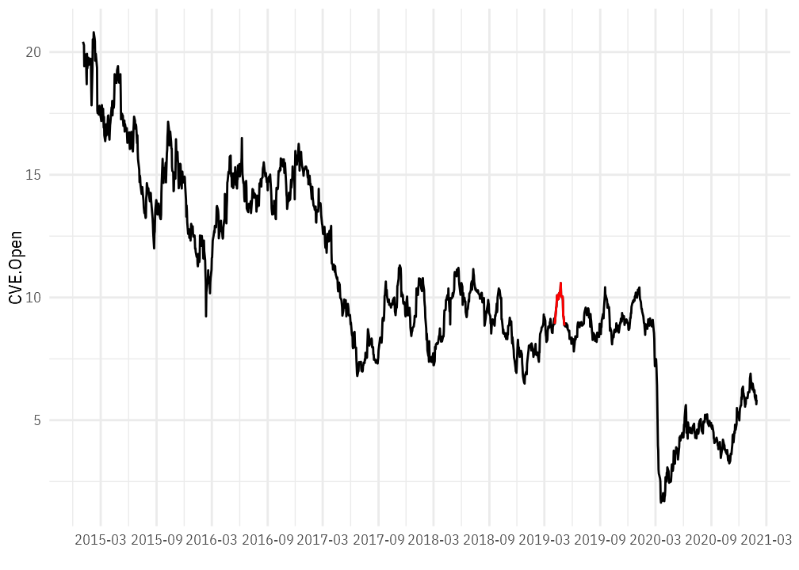
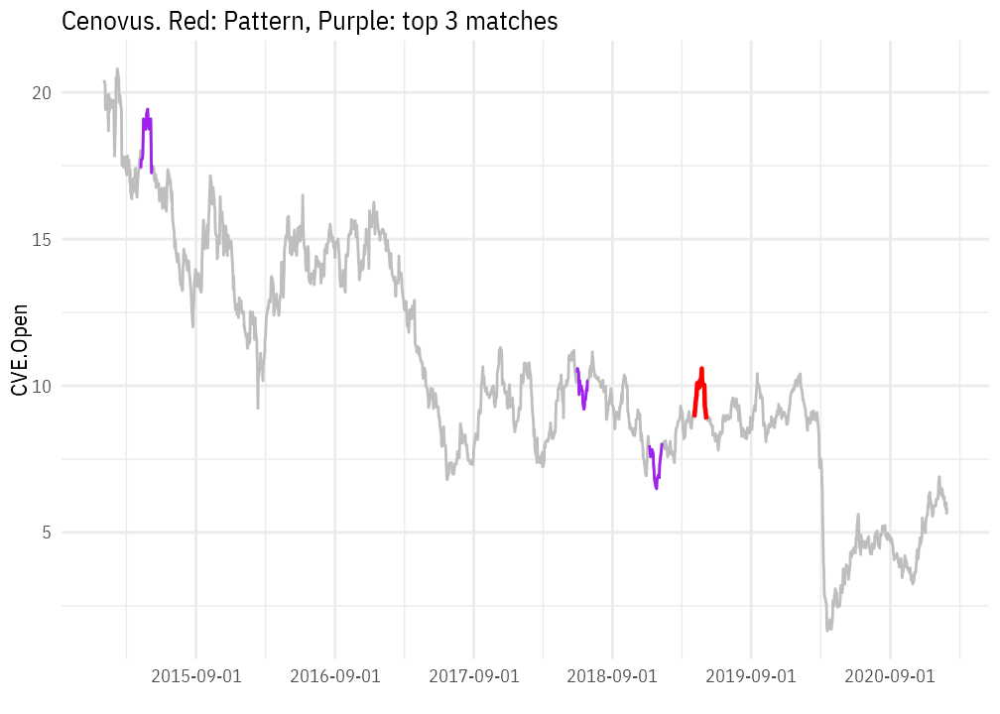

<br>


<br><br>


# Data
This is an attempt at using a non-linear measure of correlation to identify similar trend in a time series. The idea and code is heavily influenced by [this article](http://yunus.hacettepe.edu.tr/~iozkan/eco742/Brownian.html). Additional ideas (not yet implemented) are influenced by Rob Hyndman's workshop at the RStudio::conf 2020.


<br><br><br>


# Distance Correlation
[Distance correlation](https://en.wikipedia.org/wiki/Distance_correlation) is a type of correlation that can detect non-linear and non-monotonic correlations. I became aware of distance correlation from a [comment to an article](https://arxiv.org/pdf/1401.7645.pdf) discussing problems with a another non-linear, non-monotonic correlation measure.


<!-- https://pkg.robjhyndman.com/tsfeatures/articles/tsfeatures.html -->


<br><br><br>

# Example: Using Distance Correlation on a Stock Ticker
Let's try this method on Apple stock indeces. First, we download Apple's data from Yahoo Finance using the `quantmod` package:


```r
## Load Suncor stock
cenovus <- getSymbols("CVE", src = 'yahoo', from = '2015-01-01', auto.assign = F) %>% 
  as.data.frame() %>% 
  rownames_to_column(var = "date") %>% 
  mutate(date = ymd(date)) %>% 
  select(date, CVE.Open)

cenovus %>% 
  slice(1:10) %>% 
  kable() %>% 
  kable_styling(bootstrap_options = c("striped", "hover", "condensed", "responsive"), full_width = TRUE, font_size = 12)
```

<table class="table table-striped table-hover table-condensed table-responsive" style="font-size: 12px; margin-left: auto; margin-right: auto;">
 <thead>
  <tr>
   <th style="text-align:left;"> date </th>
   <th style="text-align:right;"> CVE.Open </th>
  </tr>
 </thead>
<tbody>
  <tr>
   <td style="text-align:left;"> 2015-01-02 </td>
   <td style="text-align:right;"> 20.420000 </td>
  </tr>
  <tr>
   <td style="text-align:left;"> 2015-01-05 </td>
   <td style="text-align:right;"> 20.280001 </td>
  </tr>
  <tr>
   <td style="text-align:left;"> 2015-01-06 </td>
   <td style="text-align:right;"> 19.420000 </td>
  </tr>
  <tr>
   <td style="text-align:left;"> 2015-01-07 </td>
   <td style="text-align:right;"> 19.799999 </td>
  </tr>
  <tr>
   <td style="text-align:left;"> 2015-01-08 </td>
   <td style="text-align:right;"> 19.639999 </td>
  </tr>
  <tr>
   <td style="text-align:left;"> 2015-01-09 </td>
   <td style="text-align:right;"> 19.910000 </td>
  </tr>
  <tr>
   <td style="text-align:left;"> 2015-01-12 </td>
   <td style="text-align:right;"> 19.690001 </td>
  </tr>
  <tr>
   <td style="text-align:left;"> 2015-01-13 </td>
   <td style="text-align:right;"> 19.080000 </td>
  </tr>
  <tr>
   <td style="text-align:left;"> 2015-01-14 </td>
   <td style="text-align:right;"> 18.690001 </td>
  </tr>
  <tr>
   <td style="text-align:left;"> 2015-01-15 </td>
   <td style="text-align:right;"> 19.930000 </td>
  </tr>
</tbody>
</table>

<br><br>

Now let's try to identify a pattern of interest, for instance, the rapid downspike between 2015-08-11 and 2014-09-01:


```r
## Identify pattern
pattern <- cenovus %>% 
  filter(between(date, as.Date("2019-04-04"), as.Date("2019-05-06")))


cenovus %>% 
  ggplot(aes(x = date, y = CVE.Open)) +
  geom_line() +
  geom_line(data = pattern, color = "red") +
  labs(x = "") +
  scale_x_date(breaks = "6 months", date_labels = "%Y-%m" )
```



<br><br>

Let's calculate the distance correlation measure and plot the top 3:


```r
## Calculate distance
n <- nrow(pattern)
df2 <- cenovus %>%
    anti_join(pattern, by = "date") %>% ##remove pattern
    group_by(grp = as.integer(gl(n(), n, n()))) %>% ##create grouping factors
    filter(n() == n) %>% ##removes windows of unequal number (usual last)
    mutate(cor1 = DCOR(scale(pattern$CVE.Open), scale(CVE.Open))$dCor) %>% 
    ungroup()


## Plot
df3 <- df2 %>%
  mutate(rank1 = dense_rank(desc(cor1)))


ggplot() +
  ## Plot full series
  geom_line(data = cenovus, aes(x = date, y = CVE.Open), color = "grey") +
  ## Plot pattern
  geom_line(data = pattern, aes(x = date, y = CVE.Open), color = "red", size = 0.8) +
  ## Plot closest pattern by corr.x
  geom_line(data = filter(df3, rank1<=3), aes(x = date, y = CVE.Open, group = grp), color = "purple") +
  scale_x_date(breaks = "12 months") +
  labs(x = "",
       title = "Cenovus. Red: Pattern, Purple: top 3 matches")
```




<br>

The top 3 correlations are pretty close in shape. Notice that this approach cannot distinguish symmetry which is quite important for many applications. See some of the untested improvements ideas below that may help address this.

<br><br><br>


# Improvements:

Below are some improvements ideas based on creating several statistics and using principal components to reduce the dimensionality:


```r
df2 <- df %>%
    mutate(cor1      = Hmisc::spearman2(scale(pattern$var), scale(var))[[1]]) %>% 
    mutate(cor4      = Hmisc::hoeffd(scale(pattern$var), scale(var))$P[[1,2]]) %>% 
    mutate(entropy   = entropy(var) - entropy(pattern$var)) %>% 
    mutate(flat      = longest_flat_spot(var) - longest_flat_spot(pattern$var)) %>% 
    mutate(cross     = n_crossing_points(var) - n_crossing_points(pattern$var)) %>% 
    mutate(lumpiness = lumpiness(var) - lumpiness(pattern$var)) %>% 
    mutate(hurst     = hurst(var) - hurst(pattern$var)) %>% 
    mutate(nonlin    = nonlinearity(var) - nonlinearity(pattern$var)) %>% 
  
  
## Principal component or similar
df.pc <- df2 %>% 
  select(-date, -var, -grp, -lumpiness)

prc <- prcomp(df.pc, scale = TRUE)

df2 <- df2 %>% 
  bind_cols(as.data.frame(prc$x))
```


<br><br><br>
Last updated: January 29, 2021
